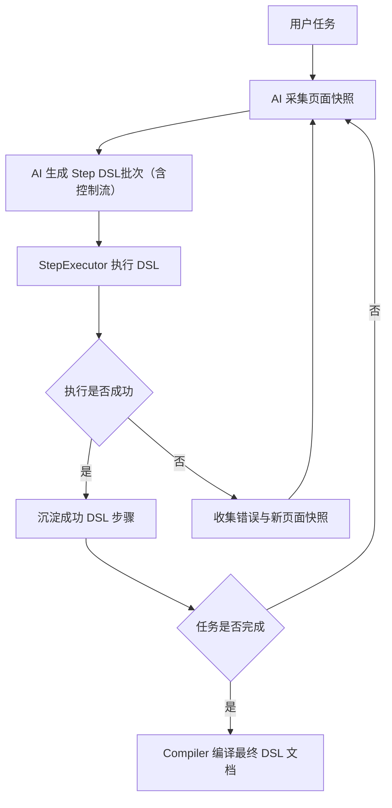

# Browser Automation DSL 架构设计文档

## 1. 背景与目标

当前底层自动化链路采用实时 ReAct 模式：

- AI 读取任务与当前页面快照
- AI 决策下一步 action
- 执行 action
- 再次读取页面快照
- 持续循环直到任务完成

这种方式灵活，但存在两个核心问题：

1. **重复任务持续消耗 token**
2. **执行过程难以沉淀为稳定可复用资产**

本次改造的目标不是简单记录历史 action，而是引入一层 **Workflow Step DSL**，让 AI 在首次运行中边观察页面、边规划、边执行、边修正，最终沉淀一份可直接回放的 DSL 文件。后续相同任务直接由执行引擎消费该 DSL，实现 **0 token 回放**。

最终目标：

- 首次运行由 AI 驱动完成探索与执行
- 首次成功后自动保存为 DSL 文档
- 后续同类任务直接加载 DSL 文档并执行
- 当内置 action 表达力不足时，通过扩展 action 能力持续增强系统

---

## 2. 核心设计原则

### 2.1 DSL 是 Tool Schema 的持久化表达

**Workflow Step DSL 不是自由语言，而是对 AI 暴露的 tool/action schema 的持久化格式。**

这意味着：

- DSL 中允许出现的 `action`，必须来自系统暴露给 AI 的内置 tool/action
- DSL 中每个 step 的 `params`，必须严格符合对应 action 的参数 schema
- DSL 不允许发明脱离 tool schema 的新动作名
- 需求超出当前 action 表达能力时，应优先新增 action，而不是放宽 DSL 自由度

这是整个架构最重要的约束。

### 2.2 首跑由 AI 驱动，复跑由 DSL 驱动

系统应明确区分两个阶段：

- **录制阶段**：AI 根据任务、页面快照、历史执行结果，直接输出可执行的 `Step DSL（允许控制流）`，DSL 立即由 StepExecutor 执行。执行成功则沉淀；失败则将错误和页面状态反馈给 AI，重新生成 DSL，再次执行，直到成功。**始终以 DSL 为唯一执行驱动，而不是事后转换。**
- **回放阶段**：执行引擎直接读取 DSL 文件，按 step 顺序执行，不调用 LLM。

这意味着：录制完成后沉淀的 DSL，是**经过验证的、实际执行成功的 DSL**，天然可回放。

### 2.3 DSL 优先服务执行，不优先服务抽象

DSL 的首要目标是：

- AI 容易稳定输出
- 引擎容易稳定解析
- 人能读懂和调试

它不是一个通用工作流平台语法，不追求复杂编排能力优先，而追求浏览器自动化可执行性优先。

### 2.4 表达力不足时扩 action，不扩 DSL 元语法

系统演进方向应是：

- 某种自动化需求无法表达 → 新增内置 action
- 给 AI 暴露新的 action schema
- DSL 自然获得新能力

而不是不断向 DSL 增加自由语法、分支语法和解释规则。

### 2.5 鲁棒性优先放入执行器与 action 内部

为保持 DSL 文件简洁，以下能力应优先内置于执行器或 action 实现中，而不是全部暴露为 DSL 字段：

- 自动等待
- 自动重试
- 自动截图
- 自动页面变化检测
- 自动失败采样

这样 DSL 文件可以保持接近参考文件 `douyin_private_message_reply.md` 的可读性和简洁性。

---

## 3. 新架构总览

新架构分为两段：

- **录制阶段（AI 驱动 DSL 生成+执行）**：AI 直接输出完整 Step DSL（允许控制流），DSL 立即交由 StepExecutor 执行。成功沉淀，失败则将错误+页面快照反馈给 AI，重新生成 DSL，再次执行。**始终以 DSL 为执行驱动。**
- **回放阶段（确定性引擎）**：直接加载首跑沉淀的 DSL，StepExecutor 确定性执行，不调用 LLM。

### 核心闭环（录制阶段）



该闭环具备三个核心特征：

1. **DSL 即执行**：AI 每轮直接输出 DSL，DSL 立即执行，产出物与执行物完全一致，沉淀的 DSL 天然可回放。
2. **控制流原生支持**：AI 可直接输出 `if/loop_for/loop_until/set_variable`，`StepExecutor` 作为控制流解释器统一执行。
3. **失败学习闭环**：执行失败的结构化错误直接反馈给 AI，无需额外 repair loop，AI 在下轮自然修正 DSL。

---

## 4. 核心模块设计

### 4.1 Agent (复用原生链路)

在录制阶段，AI 驱动的规划直接复用原生 Agent。

输入/输出/职责完全等同于 `browser-use` 原生能力：
- 接收用户任务、浏览器状态
- 通过多模型能力生成原生 action 调用
- 通过 `multi_act` 执行容错

**核心解耦点**：不再单独实现 `WorkflowPlanner`，避免维护第二套相似的 Prompt 和 LLM 解析链。

---

### 4.2 Step DSL Executor (独立引擎扩展)

Executor 是新的执行主引擎。

输入：
- 一段 step DSL

输出：
- 结构化执行结果
- 成功或失败状态
- 执行中间观测数据

职责：
- 解析 step DSL
- 对 action 与 params 做 schema 校验
- 将 step 与内置 tool/action 一一映射
- 执行 action
- 处理隐式等待、重试、页面变化检测
- 在失败时构造标准化错误反馈

Executor 是“运行层”，不负责规划。

---

### 4.3 Tool Registry

Tool Registry 仍是能力边界的来源。

职责：
- 定义系统支持的 action 名（原子 action 和控制流 action）
- 定义每个 action 的参数 schema（用于 LLM 输出校验）
- 为 `multi_act` 提供执行映射目标
- 在 record 模式下，动态注入控制流 action 的描述与 schema

因此，Tool Registry 实际上定义了 DSL 的语言边界。控制流 action 通过"描述注册"接入 prompt 感知，执行逻辑则委托给 `StepExecutor`。

---

### 4.4 失败反馈与重试（复用 Agent 原生能力）

录制阶段的错误恢复直接复用 Agent 原生能力，不再维护独立的 Repair Loop：

- 执行失败的 step 通过 `ActionResult.error` 标准结构汇报给 `multi_act`
- 错误信息进入 MessageManager 历史，供下一轮 LLM 上下文感知
- Agent 在下轮规划时基于错误历史自然修正 DSL 输出
- 连续失败超过阈值由 Agent 的 `consecutive_failures` 计数器触发终止逻辑

---

### 4.5 Workflow Compiler

Workflow Compiler 是任务结束后的沉淀模块。

职责：
- 将首次任务运行中的所有成功 step 汇总
- 去除失败尝试和探测性步骤
- 合并重复动作
- 提取可参数化变量
- 输出最终 DSL 文档

最终保存下来的不是原始 AI 输出历史，而是**编译后的可复用版本**。

---

### 4.6 Replay Engine

Replay Engine 是 0 token 回放能力的核心。

输入：
- 最终保存的 DSL 文件
- 运行时参数

输出：
- 执行结果

职责：
- 读取 DSL 文件
- 逐 step 解析和执行
- 不依赖 LLM
- 完成稳定回放

---

## 5. Workflow Step DSL 设计

### 5.1 设计要求

Step DSL 必须满足以下要求：

1. 与内置 tool/action 一一对应
2. 参数结构严格对齐 tool schema
3. 形式可读，适合 markdown 文档保存
4. 内核必须结构化，可稳定解析
5. 支持参数化输入
6. 支持后续执行引擎直接回放

---

### 5.2 Step DSL 的最小结构

每个 step 至少应包含：

- `action`
- `params`

建议可附带少量引擎保留字段：
- `id`
- `comment`
- `name`

但核心执行字段必须保持简洁，避免自由字段膨胀。

推荐形式：

```md
- step: open_dm_page
  action: navigate
  params:
    url: https://www.douyin.com/messages

- step: click_first_message
  action: click
  params:
    index: 3

- step: type_reply
  action: input
  params:
    index: 6
    text: ${reply_text}

- step: submit_reply
  action: click
  params:
    index: 8
```

其中：
- `action` 必须来自内置 tool/action
- `params` 必须严格匹配对应 action schema
- 参数变量可用 `${var}` 形式占位

---

### 5.3 文件格式建议

外层可以采用 markdown 文档，保持类似 `douyin_private_message_reply.md` 的可读性。

但必须保证：
- step block 结构稳定
- action 与 params 可直接解析
- 注释与执行块明确分离

建议文档层结构如下：
- 任务说明
- 前置准备
- 可配置参数
- Step DSL 列表
- 注意事项

这样既适合人读，也适合机器消费。

---

## 6. 执行流程设计

### 6.1 首次录制执行流程（DSL 驱动 + multi_act 执行壳）

1. 用户输入任务并启动 Agent（`workflow_mode=record`）
2. 加载 record 专用 Prompt + 扩展 action schema（含控制流 action）
3. Agent 执行 React 主循环：获取页面快照 → LLM 规划输出 DSL action 批次（可含控制流）→ `multi_act` 执行
4. 原子 action 由原生 Tool Registry 执行；控制流 action 内部委托 `StepExecutor` 递归执行，封装为 `ActionResult` 返回
5. 执行成功的 DSL step 被 Recorder 收集并暂存
6. 执行失败时，错误通过 MessageManager 注入下轮上下文，LLM 自然修正 DSL（复用原生失败闭环）
7. 任务完成（`done` action），Compiler 汇总成功 DSL steps，编译输出最终 DSL 文档

---

### 6.2 0 Token 回放流程

1. 加载 DSL 文件
2. 注入运行时参数
3. Replay Engine 逐 step 执行
4. 每个 step 直接映射内置 tool/action
5. 整个流程不调用 AI
6. 输出最终结果

---

## 7. 执行器鲁棒性设计

为了避免 DSL 文件过重，鲁棒性优先内置于执行器和 action 实现中。

### 7.1 隐式等待

执行器应默认支持：
- 元素出现等待
- 页面加载等待
- 网络空闲等待

### 7.2 自动重试

执行器应支持：
- 有限次数重试
- 短暂延迟后重试
- 基于错误类型决定是否重试

### 7.3 结果验证

执行器应对每步执行做基础验证，例如：
- 点击后页面是否变化
- 输入后字段是否成功写入
- 导航后 URL 是否符合预期
- 提取结果是否为空

### 7.4 失败采样

执行失败时应自动记录：
- 失败 step
- 错误类型
- 当前页面快照
- 执行上下文

这些信息用于后续 Repair Loop。

---

## 8. 错误反馈与兜底设计

由于录制完全复用了原项目的 Agent 容错能力，我们无需自己实现 Planner 的 repair_loop。

而在 **回放阶段**，当执行器抛出结构化错误（如元素未找到或条件不满足）时，应可选择性支持“回放切换为 Agent”：
- `failed_step`、`action`、`params` 与当前页面状态组装为上下文
- 交还给 Agent 原生链路进行智能接管和接力完成。

---

## 9. 录制态与回放态

建议在系统内部区分两种状态。

### 9.1 录制态 DSL

特点：
- 允许包含少量调试注释
- 允许保留修复过程上下文
- 更适合 AI 生成与中间调试

### 9.2 回放态 DSL

特点：
- 只保留最终成功 step
- 去除失败尝试
- 去除临时修复噪音
- 参数完成泛化
- 最适合执行引擎直接回放

最终落盘的 DSL 文件应优先以回放态为目标。

---

## 10. 参数化与复用设计

为了让 DSL 文件具备长期复用价值，系统必须支持参数化。

典型可参数化内容包括：
- 搜索词
- 回复内容
- 用户名
- 时间范围
- 页面地址
- 业务输入内容

保存 DSL 文件时，应自动识别适合抽象为变量的参数，并以占位符方式表达。

这样同一份 DSL 文件才能服务不同任务实例。

---

## 11. 扩展策略

随着业务复杂度提升，内置 action 可能不足以表达所有自动化需求。

### 两类 Action 注册表的职责区分

系统同时存在两个注册体系，需要明确职责：

| 注册体系 | 职责 | 注册位置 |
|---------|------|---------|
| **Agent Tool Registry**（原生） | 原子浏览器动作（click/input/navigate/scroll 等），被 `multi_act` 直接调用，LLM 通过 prompt 暴露这些 schema | 原项目 Tool Registry |
| **DSL 控制流执行引擎**（新增） | 控制流元件的执行逻辑（if/loop_for/loop_until/set_variable），在 `StepExecutor` 内部处理，不走 Tool Registry 查找表 | `workflow_dsl/executor.py` |

### 关键冲突澄清

原 `11. 扩展策略` 中"独立注册到 workflow_dsl"的说法，与 `11.3 Prompt / Schema` 中"注册表驱动 prompt"的说法并不冲突，但指向的是两个不同层次：

1. **控制流 action 注册到 Agent Tool Registry（用于 prompt 生成）**
   - 将 `if`/`loop_for`/`loop_until`/`set_variable` 也在 Agent Tool Registry 中登记（描述 + schema）。
   - 这样 prompt 构建时能自动读取这些 action 的说明和参数约束，注入给大模型。
   - 登记信息可以由 `workflow_dsl/` 侧在 record 模式初始化时动态注入，不硬编码到原 Agent。

2. **控制流 action 执行逻辑留在 `workflow_dsl/executor.py`（用于运行时执行）**
   - 注册到 Tool Registry 的控制流 action，执行时委托给 `StepExecutor` 处理。
   - `StepExecutor` 里的控制流逻辑依然与原 Agent 完全隔离，不侵入主干。

总结：**"注册（描述+schema）"与"执行逻辑"可以分离**。控制流 action 的描述注册到 Agent Tool Registry，执行逻辑保留在 `workflow_dsl/` 侧，通过 Tool 的执行委托实现解耦。

### 扩展推荐路径

1. 识别缺失能力（原子 or 控制流）
2. 定义其参数 schema 和描述
3. **原子 action**：直接注册到原 Agent Tool Registry（走原路）
4. **控制流/扩展 action**：在 `workflow_dsl/` 实现执行逻辑 + 在 record 模式初始化时动态注入到 Agent Tool Registry 描述层
5. DSL 自动获得新表达能力，prompt 也能自动感知

两类能力的归属原则（更新后）：
| 能力类型 | Schema 注册位置 | 执行逻辑位置 |
|---------|---------|------|
| 浏览器原子操作（click/input/navigate/scroll） | 原 Agent Tool Registry | 原 Tool 实现（不变）|
| 控制流（if/loop_for/loop_until/set_variable） | Agent Tool Registry（record 模式动态注入）| `workflow_dsl/executor.py` 委托执行 |
| 数据采集（extract_data/http_request） | Agent Tool Registry（record 模式动态注入）| `workflow_dsl/` 独立实现 |

---

## 11.1 控制流 Action 适配实现思路

参考 `douyin_private_message_reply.md` 这类复杂 DSL，控制流元件是实现工业级回放任务的关键。

### 现状（已实现）

`StepExecutor`（位于 [`browser_use/workflow_dsl/executor.py`](browser_use/workflow_dsl/executor.py)）已独立实现以下控制流 action：

| 控制流 Action | 说明 | 关键参数 |
|------------|------|---------|
| `if` | 条件分支，支持 truthy/equals/greater_than/not_empty 等运算符 | `variable`, `operator`, `expected`, `then_steps`, `else_steps` |
| `loop_for` | 遍历列表（含元素句柄列表）| `items`, `item_variable`, `index_variable`, `steps` |
| `loop_until` | 条件满足前持续循环 | `variable`, `operator`, `expected`, `max_loops`, `loop_interval`, `steps` |
| `set_variable` | 变量赋值/表达式求值 | `name`, `value`, `expression` |

这些控制流元件**不依赖原 Agent 的 Tool Registry**，是 DSL 引擎层的独立扩展实现。

### 待实现（原项目不支持，需独立扩展）

以下 action 在 `douyin_private_message_reply.md` 中也有出现，需要在 DSL 引擎层单独适配：

| action | 实现思路 | 归属 |
|--------|---------|------|
| `extract_data` | 使用 Playwright 的 `query_selector_all` + 自定义 filter_function（JS eval 执行）| DSL 引擎扩展 |
| `http_request` | Python `httpx` 客户端直接发起 HTTP 请求，解析 `extract_map` 路径提取变量 | DSL 引擎扩展 |
| `hover` | 复用或扩展 Playwright page.hover() 映射 | 可能原项目已有，确认后直接复用 |
| `wait_for_selector` | 复用 Playwright page.wait_for_selector() | 可能原项目已有 |
| `fill` | Playwright page.fill()（`fill` 和 `input` 语义类似，确认原项目 `input` 是否覆盖） | 确认复用或补充 |

### 控制流的录制态与回放态说明

| 特性 | 说明 |
|-----|------|
| 录制直出控制流 | （规划中）Agent 录制不再局限于线性 action，而是将控制流直接扩展为模型输出的 action 选项，AI 能够在录制时主动规划 if/loop_for 并立即执行。 |
| 手工/微调 DSL | 对于 `douyin_private_message_reply.md` 这类极其复杂的业务逻辑，可以在 AI 生成的骨架基础上进行人工参数微调或补充，回放引擎可无缝承接。 |
| 回放完整支持 | `StepExecutor` 已实现全套控制流 action，回放时可完整消费包含控制流的 DSL 文件。 |
| 变量作用域 | 循环变量通过 `item_variable`/`index_variable` 注入，循环结束后自动恢复，避免副作用。 |

---

## 11.2 DSL 驱动的录制执行架构（P1 演进目标）

为了让录制阶段也能真正产出如 `douyin_private_message_reply.md` 的控制流 DSL，我们将从当前的“旁路录制原子动作”演进为 **DSL 直接驱动执行** 的架构：

### 架构演进核心：统一 `multi_act` 的执行壳

**原则：最大程度复用 Agent 的 `multi_act` 综合能力，只在最内层解耦控制流的原子执行。**

1. **统一模型出口**：
   - 扩展 `AgentOutput` 的 `action` 字段，允许将 `if`, `loop_for` 注册为标准的合法 Action。
   - 大模型对 `action` 语义敏感度高，能天然识别并在规划时主动输出循环与条件判断。

2. **统一执行外壳（复用 `multi_act`）**：
   - Agent 主循环依然走原生的 `multi_act`，不改动其失败重试、History归档、MessageManager反馈等工程稳态逻辑。
   - `multi_act` 对所有 action 一视同仁，不需知道 `loop_for` 怎么跑。

3. **解耦原子执行器（StepExecutor）**：
   - 在 `workflow_dsl/` 新增控制流的 Tool 封装（如 `ControlFlowTools`）。
   - 当 `multi_act` 执行到 `loop_for` tool 时，内部实例化 `StepExecutor`，由 `StepExecutor` 递归消费这段控制流 DSL。
   - `StepExecutor` 跑完后封装为标准 `ActionResult` 返回给 `multi_act`。

4. **Prompt / Schema 最小侵入融合（最关键）**：
   - **必须改 Prompt**，但改动应严格限于 `record` 模式专用 system prompt，`react` 模式 prompt 保持不变。
   - **必须改输出 Schema**，但也仅在 `record` 模式下启用“扩展 action 枚举（含控制流 action）”；`react/replay` 继续使用原子 action schema。
   - 融合方式：
     1) 通过 `workflow_mode` 在 [`AgentSettings`](browser_use/agent/views.py:87) 或 step 构建阶段分支加载 prompt 模板；
     2) 通过 `type_with_custom_actions(...)` 机制动态注入 record 专用 action schema；
     3) 不改 `multi_act` 外部调用签名，保持主链稳定。

### 11.3 Prompt & Schema 改造细则（稳定性优先）

#### A. Prompt 如何改

仅在 record 模式下追加规则，但**不手写控制流 action 的说明和参数细节**。统一采用“注册即提示”的机制：

- 控制流 action（`if`, `loop_for`, `loop_until`, `set_variable`）作为标准 Action 注册到 Tool Registry
- 在每轮 prompt 构建时，自动从注册表读取：
  - action 名称
  - action 描述
  - 参数 schema（JSON Schema）
- prompt 只声明策略规则（何时优先原子动作、何时允许控制流），具体约束由注册表 schema 自动注入

这样做有三个收益：
1. **单一真源**：Action 约束以注册表为准，不会出现“prompt 写的规则”和“执行器实际规则”漂移。
2. **低维护**：新增/变更 action 时无需手改 prompt 文案。
3. **高稳定**：LLM 每轮看到的 action 说明与运行时校验 schema 完全一致。

补充策略规则（仍保留）：
- 优先输出原子 action；只有出现明确模式（重复遍历/条件分支）时才输出控制流
- 每轮 action 数量受控（例如 `max_actions_per_step`）
- 控制流必须带安全参数（`max_loops`、`optional`、超时）

#### B. Schema 如何改

- **record 专用 schema**：从 Tool Registry 动态聚合 action schema（含控制流 action），不在代码中写死枚举。
- **react/replay 旧 schema**：继续使用原 schema，不动。

这保证了即使 record 改造出现质量波动，也不会污染默认主链路。

#### C. 与现有 Agent 架构如何融合

- 执行入口仍是 `multi_act`
- message_manager / history / telemetry / error handling 仍走原逻辑
- 仅在执行某个控制流 action 时，内部委托 `StepExecutor` 跑子图
- 返回值仍归一为 `ActionResult`，由 `multi_act` 继续处理

#### D. 稳定性防线（建议必须加）

1. **模式隔离开关**：`workflow_mode=record` 才启用控制流 prompt+schema；`react/replay` 继续原逻辑

**优势**：
- **0 侵入外围**：Agent 的容错与记忆闭环 100% 被复用。
- **DSL 即执行**：AI 输出的就是 DSL，执行的就是 DSL，执行成功后沉淀的就是 DSL。
- **高内聚低耦合**：Agent 负责“要不要循环”，StepExecutor 负责“怎么循环跑”。
- **最小扰动**：prompt/schema 改动被严格限制在 record 模式，不影响原系统默认稳定性。

---

## 12. 与最终目标的对齐关系

本架构直接服务于以下最终目标：

### 目标 1：高成功率首跑
通过复用成熟稳定、历体验证的原生 Agent React 架构，最大化保障了各类网页自动化任务的首次执行成功率和兼容性。

### 目标 2：可沉淀自动化资产
通过 Compiler 将最终跑通版本保存为 DSL 文档，而不是保存杂乱历史日志。

### 目标 3：0 token 回放
通过 Replay Engine 直接消费最终 DSL 文件，避免重复任务持续消耗 token。

### 目标 4：长期可演进
通过扩展 action 而不是扩展 DSL 元语法，保证系统长期演进仍然可控。

---

## 13. 最终结论

本次架构改造的核心，是为成熟稳定的自动化 Agent 接入外挂式资产沉淀与执行引擎能力，并最终演进为 **DSL 直接驱动执行** 的统一闭环：

**最大程度复用原生态 Agent 的综合工程能力（multi_act），将控制流与执行内核（StepExecutor）以 Tool 的形态优雅接入。**

最终系统形态应是：

- **探跑阶段**：复用 Agent 的 React 闭环探索网页，模型直接规划并输出含控制流的 DSL (`action`)。
- **执行阶段**：由原 Agent 的 `multi_act` 统管执行壳，遇到控制流 action 则委托给独立的 `StepExecutor` 递归执行，结果原路返回。
- **学习沉淀阶段**：执行失败由原生反馈闭环触发 LLM 修正 DSL；执行成功后，由 Compiler 提纯并输出高可用的最终 DSL 文档。
- **回放复用阶段**：Replay Engine 作为独立模块，直接以 0 token、高确定性回放执行沉淀好的 DSL 文件。
- **能力扩展**：对于原生不支持的动作（提取、HTTP 等），均在 `workflow_dsl/` 作为独立 Tool 扩展，坚守不侵入主干的底线。

一句话总结：

**通过给 Agent 装上 DSL 执行内核（StepExecutor）这枚"芯"，让大模型输出的每一步思考直接成为可执行、可沉淀、可回放的高阶数字资产。**

---

## 14. 录制与回放共用同一执行引擎的原则（架构守则）

### 14.1 核心结论

**录制阶段和回放阶段必须共用同一个 `StepExecutor` 执行引擎（`browser_use/workflow_dsl/executor.py`）。**

这是整个 DSL 架构最重要的一致性保证。

### 14.2 原因分析

架构设计原则 [2.2 首跑由 AI 驱动，复跑由 DSL 驱动] 强调：

> "始终以 DSL 为唯一执行驱动，而不是事后转换。"

这意味着录制阶段 AI 生成的 DSL step，必须**立即**由与回放阶段语义完全一致的执行器执行。
若录制阶段绕过 `StepExecutor`（如直接调用底层 Tool 或简化路径），则会产生**语义漂移**：

- 沉淀的 DSL 是录制成功的，但回放时使用 `StepExecutor` 执行可能失败
- 控制流（`if/loop_for/loop_until/set_variable`）与运行时变量系统在两个阶段的行为不一致
- 变量解析（`{{var}}` / `${var}`）、重试语义、输出变量提取等细节无法对齐

### 14.3 执行引擎内核必须统一的范围

以下能力必须在录制和回放两种模式下完全一致：

| 能力 | 说明 |
|-----|------|
| **变量解析** | `_resolve_variables()` 对 `{{var}}`/`${var}` 的解析规则 |
| **控制流执行** | `if/loop_for/loop_until/set_variable` 的分支、循环、变量作用域语义 |
| **运行时变量系统** | 变量的写入、读取、循环恢复逻辑（`_restore_loop_variables`） |
| **重试机制** | 非 optional step 3次重试、optional step 1次尝试 |
| **结果校验** | `_validate_action_result()` 对 input/navigate 等 action 的结果验证规则 |
| **输出变量提取** | `_extract_output_variables()` 对 `output_variable` 的提取逻辑 |

### 14.4 两阶段差异仅限于外层编排壳

录制阶段与回放阶段的区别，只应体现在执行器的**外层编排壳**，而不是执行器内部语义：

| 层次 | 录制阶段 | 回放阶段 |
|-----|---------|---------|
| **规划来源** | LLM 生成 DSL step 批次 | 从落盘 DSL 文件加载 |
| **外层编排壳** | Agent `multi_act` 驱动 | `WorkflowRuntime.replay()` 驱动 |
| **执行内核** | `StepExecutor`（同一实例） | `StepExecutor`（同一实例） |
| **失败处理** | 错误注入 MessageManager，LLM 下轮修正 | 构造 `ExecutionErrorFeedback`，终止或跳过 |
| **成功沉淀** | Recorder 收集成功 step | 不需要 |

### 14.5 架构警示：禁止出现双轨执行路径

以下模式违反本架构原则，应严格禁止：

- 录制阶段 AI 输出 action 后，直接调用 `Tools.registry.execute_action()` 而不经过 `StepExecutor`
- 录制阶段不走变量解析，回放阶段才走变量解析
- 为录制"性能优化"而绕过控制流解析逻辑
- 录制与回放使用不同的参数校验 schema 版本

任何"录制成功但回放失败"的 bug，本质上都是违反了本原则。

### 14.6 当前实现现状（v0.x）

当前代码实现状态（截至文档撰写时）：

- **回放侧**：已完整实现 DSL + `StepExecutor` 主路径，通过 `WorkflowRuntime.replay()` 驱动。
- **录制侧**：处于演进阶段（11.2 P1 目标），尚未完全走 DSL 直接驱动的 `StepExecutor` 路径。

**待完成**：录制阶段 Agent 输出的每轮 action 批次，应通过 ControlFlow Tool 委托给 `StepExecutor` 执行，而非直接调用原子 Tool，以确保录制-回放执行路径完全统一。
