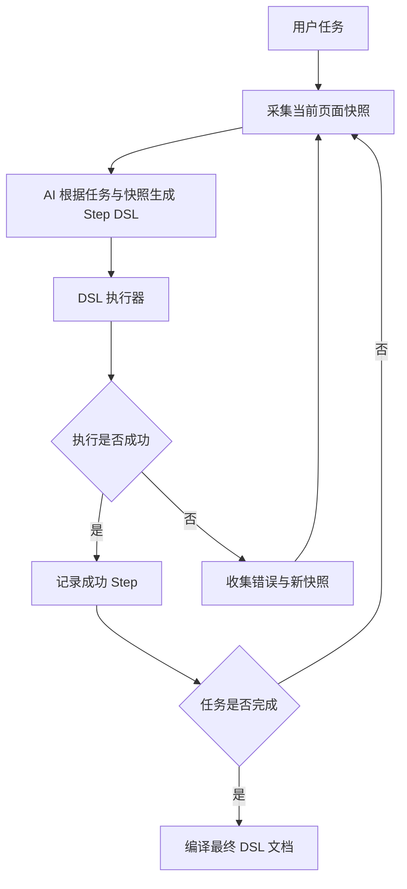

# Browser Automation DSL 架构设计文档

## 1. 背景与目标

当前底层自动化链路采用实时 ReAct 模式：

- AI 读取任务与当前页面快照
- AI 决策下一步 action
- 执行 action
- 再次读取页面快照
- 持续循环直到任务完成

这种方式灵活，但存在两个核心问题：

1. **重复任务持续消耗 token**
2. **执行过程难以沉淀为稳定可复用资产**

本次改造的目标不是简单记录历史 action，而是引入一层 **Workflow Step DSL**，让 AI 在首次运行中边观察页面、边规划、边执行、边修正，最终沉淀一份可直接回放的 DSL 文件。后续相同任务直接由执行引擎消费该 DSL，实现 **0 token 回放**。

最终目标：

- 首次运行由 AI 驱动完成探索与执行
- 首次成功后自动保存为 DSL 文档
- 后续同类任务直接加载 DSL 文档并执行
- 当内置 action 表达力不足时，通过扩展 action 能力持续增强系统

---

## 2. 核心设计原则

### 2.1 DSL 是 Tool Schema 的持久化表达

**Workflow Step DSL 不是自由语言，而是对 AI 暴露的 tool/action schema 的持久化格式。**

这意味着：

- DSL 中允许出现的 `action`，必须来自系统暴露给 AI 的内置 tool/action
- DSL 中每个 step 的 `params`，必须严格符合对应 action 的参数 schema
- DSL 不允许发明脱离 tool schema 的新动作名
- 需求超出当前 action 表达能力时，应优先新增 action，而不是放宽 DSL 自由度

这是整个架构最重要的约束。

### 2.2 首跑由 AI 驱动，复跑由 DSL 驱动

系统应明确区分两个阶段：

- **录制阶段**：AI 根据任务、页面快照、历史执行结果，持续输出 step DSL 并交由执行器运行
- **回放阶段**：执行引擎直接读取 DSL 文件，按 step 顺序执行，不调用 LLM

### 2.3 DSL 优先服务执行，不优先服务抽象

DSL 的首要目标是：

- AI 容易稳定输出
- 引擎容易稳定解析
- 人能读懂和调试

它不是一个通用工作流平台语法，不追求复杂编排能力优先，而追求浏览器自动化可执行性优先。

### 2.4 表达力不足时扩 action，不扩 DSL 元语法

系统演进方向应是：

- 某种自动化需求无法表达 → 新增内置 action
- 给 AI 暴露新的 action schema
- DSL 自然获得新能力

而不是不断向 DSL 增加自由语法、分支语法和解释规则。

### 2.5 鲁棒性优先放入执行器与 action 内部

为保持 DSL 文件简洁，以下能力应优先内置于执行器或 action 实现中，而不是全部暴露为 DSL 字段：

- 自动等待
- 自动重试
- 自动截图
- 自动页面变化检测
- 自动失败采样

这样 DSL 文件可以保持接近参考文件 `douyin_private_message_reply.md` 的可读性和简洁性。

---

## 3. 新架构总览

新架构不再是传统的 `快照 -> action -> 执行 -> 下一轮`，而是：

`快照 -> step DSL -> 执行器 -> 成功沉淀 / 失败反馈 -> 新快照 -> 新 step DSL`

### 核心闭环



该闭环具备三个核心特征：

1. 每轮 AI 仍然看页面快照，保留环境适应能力
2. AI 输出的是 DSL step，而不是立即执行的原子 action 调用
3. 最终沉淀的是执行器验证通过的 DSL 文档，而不是历史日志

---

## 4. 核心模块设计

### 4.1 Planner

Planner 是 AI 驱动的规划器。

输入：
- 用户原始任务
- 当前页面快照
- 最近若干步成功 step
- 最近一次失败信息
- 当前运行时变量
- 当前可用 tools schema

输出：
- 一段严格符合 tools schema 的 step DSL

Planner 的职责：
- 观察当前页面状态
- 基于任务目标决定下一段最合理的 step
- 仅使用系统允许的 action 名与参数结构输出 DSL
- 在失败反馈后修正后续 step

Planner **不直接执行动作**。

---

### 4.2 Step DSL Executor

Executor 是新的执行主引擎。

输入：
- 一段 step DSL

输出：
- 结构化执行结果
- 成功或失败状态
- 执行中间观测数据

职责：
- 解析 step DSL
- 对 action 与 params 做 schema 校验
- 将 step 与内置 tool/action 一一映射
- 执行 action
- 处理隐式等待、重试、页面变化检测
- 在失败时构造标准化错误反馈

Executor 是“运行层”，不负责规划。

---

### 4.3 Tool Registry

Tool Registry 仍是能力边界的来源。

职责：
- 定义系统支持的 action 名
- 定义每个 action 的参数 schema
- 为 Planner 提供唯一合法输出集合
- 为 Executor 提供唯一合法映射目标

因此，Tool Registry 实际上定义了 DSL 的语言边界。

---

### 4.4 Repair Loop

Repair Loop 用于执行失败后的恢复。

输入：
- 执行失败的 step
- 错误信息
- 失败时页面快照
- 最近已成功 step 历史

输出：
- 新的修正 step DSL

它的职责是：
- 不让系统在失败后直接终止
- 通过“失败反馈 -> AI 修正 -> 重新执行”的闭环提升首次运行成功率

---

### 4.5 Workflow Compiler

Workflow Compiler 是任务结束后的沉淀模块。

职责：
- 将首次任务运行中的所有成功 step 汇总
- 去除失败尝试和探测性步骤
- 合并重复动作
- 提取可参数化变量
- 输出最终 DSL 文档

最终保存下来的不是原始 AI 输出历史，而是**编译后的可复用版本**。

---

### 4.6 Replay Engine

Replay Engine 是 0 token 回放能力的核心。

输入：
- 最终保存的 DSL 文件
- 运行时参数

输出：
- 执行结果

职责：
- 读取 DSL 文件
- 逐 step 解析和执行
- 不依赖 LLM
- 完成稳定回放

---

## 5. Workflow Step DSL 设计

### 5.1 设计要求

Step DSL 必须满足以下要求：

1. 与内置 tool/action 一一对应
2. 参数结构严格对齐 tool schema
3. 形式可读，适合 markdown 文档保存
4. 内核必须结构化，可稳定解析
5. 支持参数化输入
6. 支持后续执行引擎直接回放

---

### 5.2 Step DSL 的最小结构

每个 step 至少应包含：

- `action`
- `params`

建议可附带少量引擎保留字段：
- `id`
- `comment`
- `name`

但核心执行字段必须保持简洁，避免自由字段膨胀。

推荐形式：

```md
- step: open_dm_page
  action: navigate
  params:
    url: https://www.douyin.com/messages

- step: click_first_message
  action: click
  params:
    index: 3

- step: type_reply
  action: input
  params:
    index: 6
    text: ${reply_text}

- step: submit_reply
  action: click
  params:
    index: 8
```

其中：
- `action` 必须来自内置 tool/action
- `params` 必须严格匹配对应 action schema
- 参数变量可用 `${var}` 形式占位

---

### 5.3 文件格式建议

外层可以采用 markdown 文档，保持类似 `douyin_private_message_reply.md` 的可读性。

但必须保证：
- step block 结构稳定
- action 与 params 可直接解析
- 注释与执行块明确分离

建议文档层结构如下：
- 任务说明
- 前置准备
- 可配置参数
- Step DSL 列表
- 注意事项

这样既适合人读，也适合机器消费。

---

## 6. 执行流程设计

### 6.1 首次录制执行流程

1. 用户输入任务
2. 系统采集当前页面快照
3. Planner 基于任务、快照、tool schema 输出 step DSL
4. Executor 校验并执行 step DSL
5. 成功则写入成功 step 集合
6. 若未完成，则采集新页面快照进入下一轮
7. 若失败，则收集错误信息与新快照，反馈给 Planner
8. Planner 输出修正 step DSL
9. 循环直到任务完成
10. Compiler 输出最终 DSL 文件

---

### 6.2 0 Token 回放流程

1. 加载 DSL 文件
2. 注入运行时参数
3. Replay Engine 逐 step 执行
4. 每个 step 直接映射内置 tool/action
5. 整个流程不调用 AI
6. 输出最终结果

---

## 7. 执行器鲁棒性设计

为了避免 DSL 文件过重，鲁棒性优先内置于执行器和 action 实现中。

### 7.1 隐式等待

执行器应默认支持：
- 元素出现等待
- 页面加载等待
- 网络空闲等待

### 7.2 自动重试

执行器应支持：
- 有限次数重试
- 短暂延迟后重试
- 基于错误类型决定是否重试

### 7.3 结果验证

执行器应对每步执行做基础验证，例如：
- 点击后页面是否变化
- 输入后字段是否成功写入
- 导航后 URL 是否符合预期
- 提取结果是否为空

### 7.4 失败采样

执行失败时应自动记录：
- 失败 step
- 错误类型
- 当前页面快照
- 执行上下文

这些信息用于后续 Repair Loop。

---

## 8. 错误反馈设计

错误反馈必须结构化，而不能只是一段自然语言日志。

建议至少包含：
- `failed_step`
- `action`
- `params`
- `error_type`
- `error_message`
- `page_snapshot`
- `last_success_step`
- `runtime_variables`

这样 Planner 才能更精准地生成修正 step DSL。

---

## 9. 录制态与回放态

建议在系统内部区分两种状态。

### 9.1 录制态 DSL

特点：
- 允许包含少量调试注释
- 允许保留修复过程上下文
- 更适合 AI 生成与中间调试

### 9.2 回放态 DSL

特点：
- 只保留最终成功 step
- 去除失败尝试
- 去除临时修复噪音
- 参数完成泛化
- 最适合执行引擎直接回放

最终落盘的 DSL 文件应优先以回放态为目标。

---

## 10. 参数化与复用设计

为了让 DSL 文件具备长期复用价值，系统必须支持参数化。

典型可参数化内容包括：
- 搜索词
- 回复内容
- 用户名
- 时间范围
- 页面地址
- 业务输入内容

保存 DSL 文件时，应自动识别适合抽象为变量的参数，并以占位符方式表达。

这样同一份 DSL 文件才能服务不同任务实例。

---

## 11. 扩展策略

随着业务复杂度提升，内置 action 可能不足以表达所有自动化需求。

此时推荐演进路径是：

1. 识别缺失能力
2. 新增对应 action
3. 定义其参数 schema
4. 注册到 tool/action 集合
5. 暴露给 Planner
6. DSL 自动获得新表达能力

而不是通过 DSL 增加大量特殊语法。

这样可以保证：
- DSL 语言长期稳定
- 系统能力通过 action 扩展
- 执行器逻辑保持简单

---

## 12. 与最终目标的对齐关系

本架构直接服务于以下最终目标：

### 目标 1：高成功率首跑
通过 `快照 -> step DSL -> 执行 -> 失败反馈 -> 修正 DSL` 闭环，提高首次任务执行成功率。

### 目标 2：可沉淀自动化资产
通过 Compiler 将最终跑通版本保存为 DSL 文档，而不是保存杂乱历史日志。

### 目标 3：0 token 回放
通过 Replay Engine 直接消费最终 DSL 文件，避免重复任务持续消耗 token。

### 目标 4：长期可演进
通过扩展 action 而不是扩展 DSL 元语法，保证系统长期演进仍然可控。

---

## 13. 最终结论

本次架构改造的核心，不是简单把实时 action 记录下来，而是把整个浏览器自动化链路升级为：

**AI 在线生成符合 tool schema 的 Step DSL，执行器验证并沉淀为可回放 DSL 文档。**

最终系统形态应是：

- 在线阶段：AI 参考页面快照生成 step DSL
- 执行阶段：Executor 按 step DSL 调用内置 tool/action
- 修复阶段：失败后将结构化错误反馈给 AI 继续生成 step DSL
- 沉淀阶段：Compiler 输出最终 DSL 文件
- 复用阶段：Replay Engine 直接 0 token 回放 DSL 文件

一句话总结：

**让 Workflow Step DSL 成为内置 tool/action 的持久化表达，并把首跑成功经验沉淀为后续可直接执行的自动化资产。**
